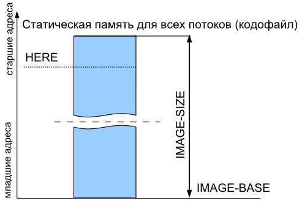
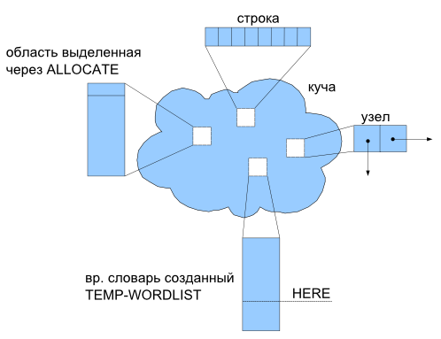
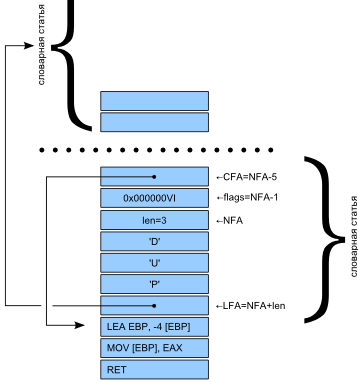

<a id="start"/>

Устройство [SPF](readme.ru.html)
================================

<title>Устройство SPF</title>

<i>Детали реализации ядра</i>

<small>Последнее обновление: $Date$</small>

<!-- $Revision$ -->

----

<!-- [[Английский](src.en.html)] --> [[Русский](src.ru.html)] 

----

##Содержание

* [Распределение регистров](#regs)
* [Стеки](#stack)
* [Хранилище](#image)
* [Динамическая память](#heap)
* [Словарная статья](#article)
* [Перекомпиляция ядра](#make-kernel)
* [Макрооптимизатор](#macroopt)
* [>VIRT](#tovirt)

----
<a id="regs"/>
###[Распределение регистров](#regs)

* EAX - вершина стека данных
* EBP - указатель на стек данных (т.е. [EBP] - второй элемент стека данных)
* ESP - указатель на стек возвратов
* EDI - указатель на данные потока (указывает на начало USER-области текущего потока)

----
<a id="stack"/>
###[Стеки](#stack)

Стек возвратов совмещен с аппаратным стеком (ESP).
Стек параметров адресуется регистром EBP, вершина стека хранится в EAX

Указатели стеков: `SP@` `RP@` `SP!` `RP!`

Дно стеков: `S0` `R0` 

Оба стека начиная от своего дна, растут вниз (в сторону уменьшения адресов).

( `src/compiler/spf_translate.f` )

----
<a id="image"/>
###[Хранилище](#image)

Пространства кода и данных совмещены.
Слова доступа к пространству данных стандартны: `HERE` `ALLOT` `,` `C,`
(они же служат и для формирования кода, в силу совмещенности).
Слово `UNUSED` вынесено в `lib/include/core-ext.f`

`IMAGE-BASE` - адрес начало базового хранилища.

`IMAGE-SIZE` - размер памяти, выделяемой под базовое хранилище при загрузке.

Временные словари ( `TEMP-WORDLIST`, `FREE-WORDLIST` ).
Такой словарь ассоциирован с собственным хранилищем
(память для которого распределяется динамически).

Когда такой словарь является текущим
(`CURRENT` - т.е., словарем в который добавляются новые слова)
`HERE` дает начало свободной области его хранилища.

Следует отметить, что содержимое обычных словарей, созданных во временном словаре,
все-равно пойдет в базовое хранилище.
Расширение `~pinka/spf/storage.f` решает эту проблему.

Контекст (`ORDER`, `CURRENT`) у каждого потока свой
(по умолчанию: `ONLY FORTH DEFINITIONS`).
Поддерживается параллельная трансляция.
Но, компиляция в одно хранилище должна осуществляться только одним потоком (во избежании).

----
<a id="heap"/>
###[Динамическая память](#heap)

*Windows:* У каждого потока свой хип. `ALLOCATE` выделяет память из хипа потока, в контексте 
которого вызвано. При завершении потока его хип уничтожается (вся память выделенная 
из этого хипа -- освобождается).

*Linux:* Отдельных хипов нет. **FIXME** Надо ли синхронизировать ALLOCATE?

Хип процесса ядром форт-системы не используется.
(хотя в принципе, его можно использовать, и некоторые расширения делают это).

*Windows:* При доступе к разделяемому хипу из разных потоков стоит вспомнить о необходимости синхронизации.

Кроме отдельной кучи каждый поток имеет свой собственный блок статических данных
-- USER-область (размером `EXTRA-MEM`, по-умолчанию 8кб). Переменные и массивы 
резервируются там словами словами `USER` , `USER-VALUE` .

----
<a id="article"/>
###[Словарная статья](#article)

Словарь является односвязным списком с полем имени (его адрес обозначаемый как NFA 
используется для идентификации конкретной словарной статьи в словаре), полем кода 
в котором хранится `xt` действия данного слова, полем флагов (содержит признаки, 
характеризующие это слово -- `&IMMEDIATE` и `&VOC` )

Т. н. "поля параметров" нет, так как "телом" определений в SPF являются последовательности
машинных инструкций.

**FIXME** описание VOC-NAME! PAR! CLASS!

( `src/compiler/spf_wordlist.f` )

----
<a id="make-kernel"/>
###[Перекомпиляция ядра](#make-kernel)

**FIXME** перенести в intro

В файле `src/spf_compileoptions.f` описаны параметры компиляции по умолчанию которые можно 
переопределить в `src/compile.ini`.

*Windows:* Компиляция ядра выполняется запуском bat-файла `src/compile.bat`. По умолчанию, 
сборку выполняет одна их младших версий SPF (`jpf375c.exe` в корневой папке), но
SPF может и сам собирать себя. 
Пререквизиты для сборки : 

* исходники (`src` и `lib`) 
* целевой компилятор (например [jpf375c.exe](http://downloads.sourceforge.net/spf/JPF375C.EXE))

*Linux:* Для перекомпиляции ядра можно использовать `src/compile` или `src/Makefile`. Во время
сборки компилируется и выполняется программа на Си (`config.gen`) которая генерирует `src/posix/config.auto.f` с
определениями системно-зависимых констант. Целевой компилятор создаёт объектный файл, который потом
линкуется с системными библиотеками (libdl, libc, libpthread). В `src/compile.ini` необходимо вписать :

    TRUE TO TARGET-POSIX \ сборка для Linux
    TRUE TO UNIX-ENVIRONMENT \ юниксовый EOLN
Пререквизиты для сборки :

* исходники (`src` и `lib`)
* целевой компилятор (`spf4orig` (ранее собранный бинарник) либо `jpf375c.exe` под [wine](http://winehq.org/))
* gcc (файлы include'ов, препроцессор, компилятор, линкер) **FIXME** точнее (имена пакетов)
* src/compile.ini

----
<a id="macroopt"/>
###[Макрооптимизатор](#macroopt)

#### Оптимизация основанная на шаблонах машинного кода

Именно эти шаблоны и реакции на них составляют подавляющую часть 100 с лишним килобайт оптимизатора 
(файл `src/macroopt.f` ). Такая оптимизация на шаблонах в SPF4 заключается в том, что происходит 
подмена скомпилированного кода командой `OPT-RULES`. `OPT-RULES` содержит набор правил оптимизации,
представленных в виде программы. Каждое правило состоит из 2-х частей: идентификации кода и процедуры 
подмены. Доступ к коду осуществляется посредством массива ссылок на последние операторы `OP0`.
Использование `OP0` позволяет отделить коды команд от их операндов.

Правило замены фрагмента кода:

     NEG     EAX            \ F7 D8
     ADD     EAX , 0 [EBP]  \ 03 45 00
     NEG     EAX            \ F7 D8

на:

     SUB     EAX , 0 [EBP]  \  2B 45 00

Представляет собой:

     OP2 @  @  4503D8F7 XOR           \  NEG EAX  ADD EAX, X [EBP]
     OP0 @  W@ D8F7     XOR    OR 0=  \ NEG EAX
     IF  M\ 20 DTST
          OP1 @ @ 452B OR OP2 @ ! \  SUB EAX, X [EBP]
          OP2 ToOP0
          -4 ALLOT
          FALSE M\ 21 DTST
          EXIT
     THEN

#### Подключение

Во время компиляции ядра макрооптимизатор подключается два раза :

* в инструментальную систему, используется в процессе сборки для оптимизации кода целевой
  (создаваемой) системы, подключается в `src/tc_spf.F` (USE-OPTIMIZER)
* в целевую систему, для того чтобы новая система во время исполнения генерировала оптимизированный
  код, подключается в `src/spf.f` (BUILD-OPTIMIZER)

#### Переменные из macroopt.f которые используются в ядре.

`OPT?` -- состояние оптимизатора: включён/выключен.

`MM_SIZE` -- максимальный размер слова (в байтах) который позволено "разворачивать" 
("инлайнить") оптимизатору.

`:-SET` -- устанавливает границу для оптимизатора, все команды находящиеся по адресам младшим 
значения `:-SET`, оптимизатор не трогает.

`LAST-HERE` устанавливает адрес конца последней скомпилированной маш. инструкции. `LAST-HERE`
приравнивается в ядре `HERE` только по окончании каждой транзакции компиляции.

`OP0`, `OP1`, ... `OP8` -- адреса 9-и последних скомпилированных машинных команд (`OP0` 
-- адрес начала самой последнего скомпилированной машинной инструкции, `OP1` -- адрес начала предпоследней 
инструкции, и т.д.).

`JP0`, `JP1`, ... `JP4` -- адреса пяти последних скомпилированных машинных команд -- ветвлений 
(как условных так и безусловных).

----
<a id="tovirt"/>
###[>VIRT](#tovirt)

Пользовательское пространство начинается под Windows 
с 0x500000, а под Линукс - гораздо дальше, в запрещенных для 
вин-программы адресах. Из-за этого приходится пересчитывать адреса при кросс-компиляции на Windows
объектного ELF файла для Linux. Если делать SPF/Linux под Линукс, то >VIRT не нужен.

----
